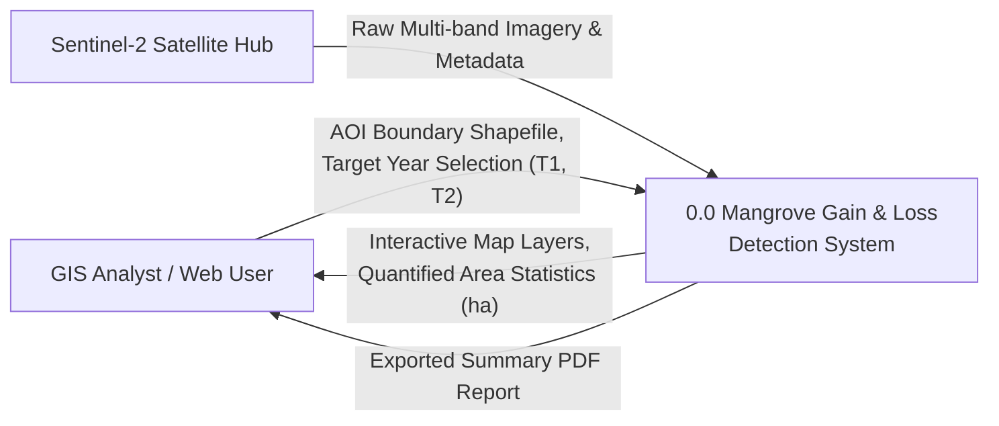

```mermaid
flowchart LR
    %% External Entities
    User["GIS Analyst / Web User"]
    SatHub["Sentinel-2 Satellite Hub"]

    %% Central System Process
    System["0.0 Mangrove Gain & Loss<br>Detection System"]

    %% Data Flows
    User -->|"AOI Boundary Shapefile,<br>Target Year Selection (T1, T2)"| System
    SatHub -->|"Raw Multi-band Imagery & Metadata"| System
    
    System -->|"Interactive Map Layers,<br>Quantified Area Statistics (ha)"| User
    System -->|"Exported Summary PDF Report"| User
```
