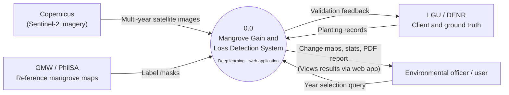

```mermaid
flowchart LR
    %% External Entities
    E1["Copernicus<br>(Sentinel-2 imagery)"]
    E2["GMW / PhilSA<br>Reference mangrove maps"]
    E3["LGU / DENR<br>Client and ground truth"]
    E4["Environmental officer / user"]

    %% Central Process
    P0(("0.0<br>Mangrove Gain and<br>Loss Detection System<br><sub style='font-size:10px;'>Deep learning + web application</sub>"))

    %% Data Flows
    E1 -->|"Multi-year satellite images"| P0
    E2 -->|"Label masks"| P0
    E3 -->|"Planting records"| P0
    P0 -->|"Validation feedback"| E3

    E4 -->|"Year selection query"| P0
    P0 -->|"Change maps, stats, PDF report<br>(Views results via web app)"| E4
```
