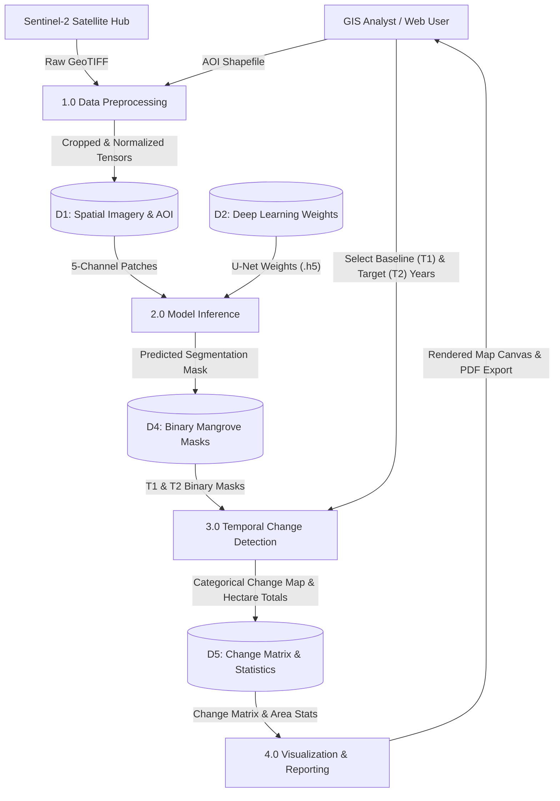

```mermaid
flowchart TD
    %% External Entities
    User["GIS Analyst / Web User"]
    SatHub["Sentinel-2 Satellite Hub"]

    %% Processes
    P1["1.0 Data Preprocessing"]
    P2["2.0 Model Inference"]
    P3["3.0 Temporal Change Detection"]
    P4["4.0 Visualization & Reporting"]

    %% Data Stores
    D1[("D1: Spatial Imagery & AOI")]
    D2[("D2: Deep Learning Weights")]
    D4[("D4: Binary Mangrove Masks")]
    D5[("D5: Change Matrix & Statistics")]

    %% Inputs & Preprocessing
    SatHub -->|"Raw GeoTIFF"| P1
    User -->|"AOI Shapefile"| P1
    P1 -->|"Cropped & Normalized Tensors"| D1

    %% Inference
    D1 -->|"5-Channel Patches"| P2
    D2 -->|"U-Net Weights (.h5)"| P2
    P2 -->|"Predicted Segmentation Mask"| D4

    %% Change Analysis
    User -->|"Select Baseline (T1) & Target (T2) Years"| P3
    D4 -->|"T1 & T2 Binary Masks"| P3
    P3 -->|"Categorical Change Map & Hectare Totals"| D5

    %% Dashboard & Export
    D5 -->|"Change Matrix & Area Stats"| P4
    P4 -->|"Rendered Map Canvas & PDF Export"| User
```
