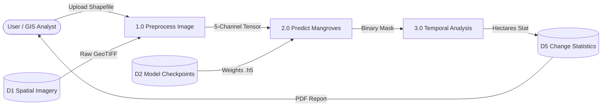

```mermaid
flowchart LR
    %% External Entities
    User([User / GIS Analyst])
    
    %% Processes
    P1[1.0 Preprocess Image]
    P2[2.0 Predict Mangroves]
    P3[3.0 Temporal Analysis]
    
    %% Data Stores
    D1[(D1 Spatial Imagery)]
    D2[(D2 Model Checkpoints)]
    D5[(D5 Change Statistics)]
    
    %% Flows
    User -->|Upload Shapefile| P1
    D1 -->|Raw GeoTIFF| P1
    P1 -->|5-Channel Tensor| P2
    D2 -->|Weights .h5| P2
    P2 -->|Binary Mask| P3
    P3 -->|Hectares Stat| D5
    D5 -->|PDF Report| User
```
