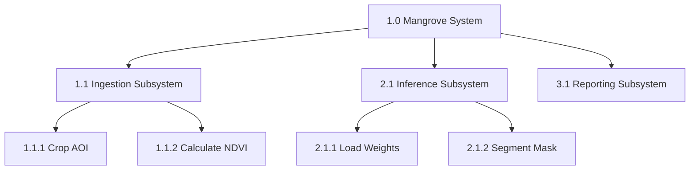

```mermaid
flowchart TD
    Root["1.0 Mangrove System"]
    
    Root --> Module1["1.1 Ingestion Subsystem"]
    Root --> Module2["2.1 Inference Subsystem"]
    Root --> Module3["3.1 Reporting Subsystem"]
    
    Module1 --> Child1["1.1.1 Crop AOI"]
    Module1 --> Child2["1.1.2 Calculate NDVI"]
    
    Module2 --> Child3["2.1.1 Load Weights"]
    Module2 --> Child4["2.1.2 Segment Mask"]
```
