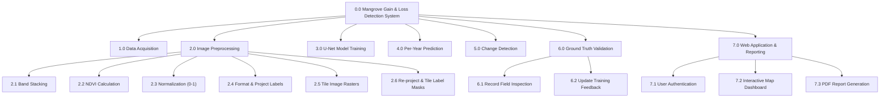

```mermaid
flowchart TD
    ROOT["0.0 Mangrove Gain & Loss Detection System"]

    %% Level 1 Modules
    ROOT --> M1["1.0 Data Acquisition"]
    ROOT --> M2["2.0 Image Preprocessing"]
    ROOT --> M3["3.0 U-Net Model Training"]
    ROOT --> M4["4.0 Per-Year Prediction"]
    ROOT --> M5["5.0 Change Detection"]
    ROOT --> M6["6.0 Ground Truth Validation"]
    ROOT --> M7["7.0 Web Application & Reporting"]

    %% Level 2 Sub-modules for Preprocessing (Module 2.0 Rectified)
    M2 --> M21["2.1 Band Stacking"]
    M2 --> M22["2.2 NDVI Calculation"]
    M2 --> M23["2.3 Normalization (0-1)"]
    M2 --> M24["2.4 Format & Project Labels"]
    M2 --> M25["2.5 Tile Image Rasters"]
    M2 --> M26["2.6 Re-project & Tile Label Masks"]

    %% Level 2 Sub-modules for Validation (Module 6.0)
    M6 --> M61["6.1 Record Field Inspection"]
    M6 --> M62["6.2 Update Training Feedback"]

    %% Level 2 Sub-modules for Web Application (Module 7.0)
    M7 --> M71["7.1 User Authentication"]
    M7 --> M72["7.2 Interactive Map Dashboard"]
    M7 --> M73["7.3 PDF Report Generation"]
```
