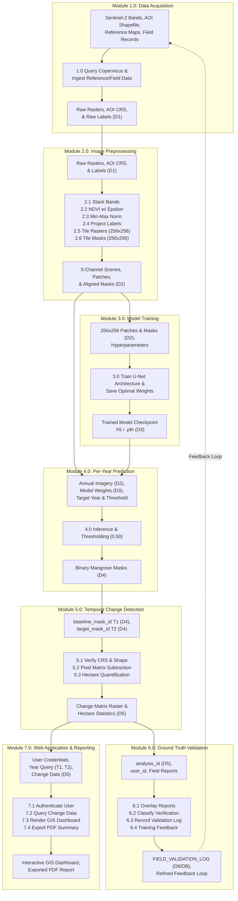

```mermaid
flowchart TD
    %% Module 1.0: Data Acquisition
    subgraph M1 ["Module 1.0: Data Acquisition"]
        direction LR
        I1["Sentinel-2 Bands, AOI Shapefile,<br>Reference Maps, Field Records"] --> P1["1.0 Query Copernicus &<br>Ingest Reference/Field Data"] --> O1["Raw Rasters, AOI CRS,<br>& Raw Labels (D1)"]
    end

    %% Module 2.0: Image Preprocessing
    subgraph M2 ["Module 2.0: Image Preprocessing"]
        direction LR
        I2["Raw Rasters, AOI CRS,<br>& Labels (D1)"] --> P2["2.1 Stack Bands<br>2.2 NDVI w/ Epsilon<br>2.3 Min-Max Norm<br>2.4 Project Labels<br>2.5 Tile Rasters (256x256)<br>2.6 Tile Masks (256x256)"] --> O2["5-Channel Scenes, Patches,<br>& Aligned Masks (D2)"]
    end

    %% Module 3.0: Model Training
    subgraph M3 ["Module 3.0: Model Training"]
        direction LR
        I3["256x256 Patches & Masks (D2),<br>Hyperparameters"] --> P3["3.0 Train U-Net Architecture &<br>Save Optimal Weights"] --> O3["Trained Model Checkpoint<br>.h5 / .pth (D3)"]
    end

    %% Module 4.0: Per-Year Prediction
    subgraph M4 ["Module 4.0: Per-Year Prediction"]
        direction LR
        I4["Annual Imagery (D2),<br>Model Weights (D3),<br>Target Year & Threshold"] --> P4["4.0 Inference & Thresholding (0.50)"] --> O4["Binary Mangrove Masks (D4)"]
    end

    %% Module 5.0: Temporal Change Detection
    subgraph M5 ["Module 5.0: Temporal Change Detection"]
        direction LR
        I5["baseline_mask_id T1 (D4),<br>target_mask_id T2 (D4)"] --> P5["5.1 Verify CRS & Shape<br>5.2 Pixel Matrix Subtraction<br>5.3 Hectare Quantification"] --> O5["Change Matrix Raster &<br>Hectare Statistics (D5)"]
    end

    %% Module 6.0: Ground Truth Validation
    subgraph M6 ["Module 6.0: Ground Truth Validation"]
        direction LR
        I6["analysis_id (D5),<br>user_id, Field Reports"] --> P6["6.1 Overlay Reports<br>6.2 Classify Verification<br>6.3 Record Validation Log<br>6.4 Training Feedback"] --> O6["FIELD_VALIDATION_LOG (D6/DB),<br>Refined Feedback Loop"]
    end

    %% Module 7.0: Web App & Reporting
    subgraph M7 ["Module 7.0: Web Application & Reporting"]
        direction LR
        I7["User Credentials,<br>Year Query (T1, T2),<br>Change Data (D5)"] --> P7["7.1 Authenticate User<br>7.2 Query Change Data<br>7.3 Render GIS Dashboard<br>7.4 Export PDF Summary"] --> O7["Interactive GIS Dashboard,<br>Exported PDF Report"]
    end

    %% Pipeline Inter-Module Data Connections
    O1 --> I2
    O2 --> I3
    O2 --> I4
    O3 --> I4
    O4 --> I5
    O5 --> I6
    O5 --> I7
    O6 -. Feedback Loop .-> I1
```
