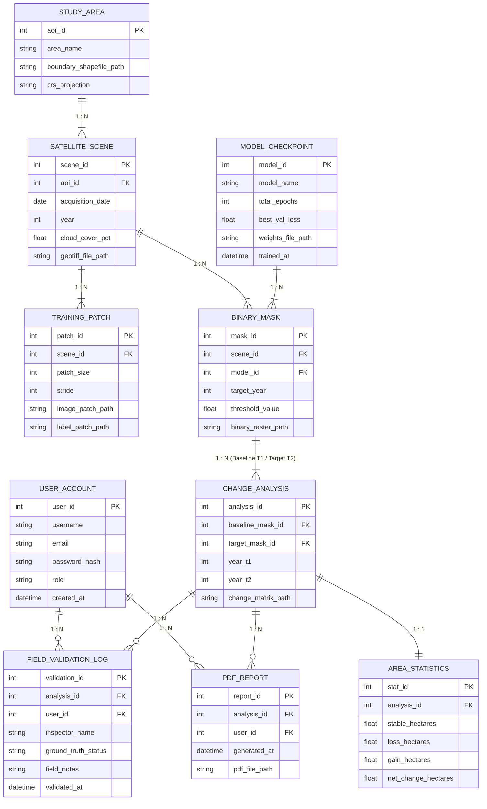

```mermaid
erDiagram
    USER_ACCOUNT ||--o{ PDF_REPORT : "1 : N"
    USER_ACCOUNT ||--o{ FIELD_VALIDATION_LOG : "1 : N"
    STUDY_AREA ||--|{ SATELLITE_SCENE : "1 : N"
    SATELLITE_SCENE ||--|{ TRAINING_PATCH : "1 : N"
    SATELLITE_SCENE ||--|{ BINARY_MASK : "1 : N"
    MODEL_CHECKPOINT ||--|{ BINARY_MASK : "1 : N"
    BINARY_MASK ||--|{ CHANGE_ANALYSIS : "1 : N (Baseline T1 / Target T2)"
    CHANGE_ANALYSIS ||--|| AREA_STATISTICS : "1 : 1"
    CHANGE_ANALYSIS ||--o{ PDF_REPORT : "1 : N"
    CHANGE_ANALYSIS ||--o{ FIELD_VALIDATION_LOG : "1 : N"

    USER_ACCOUNT {
        int user_id PK
        string username
        string email
        string password_hash
        string role
        datetime created_at
    }

    STUDY_AREA {
        int aoi_id PK
        string area_name
        string boundary_shapefile_path
        string crs_projection
    }

    SATELLITE_SCENE {
        int scene_id PK
        int aoi_id FK
        date acquisition_date
        int year
        float cloud_cover_pct
        string geotiff_file_path
    }

    TRAINING_PATCH {
        int patch_id PK
        int scene_id FK
        int patch_size
        int stride
        string image_patch_path
        string label_patch_path
    }

    MODEL_CHECKPOINT {
        int model_id PK
        string model_name
        int total_epochs
        float best_val_loss
        string weights_file_path
        datetime trained_at
    }

    BINARY_MASK {
        int mask_id PK
        int scene_id FK
        int model_id FK
        int target_year
        float threshold_value
        string binary_raster_path
    }

    CHANGE_ANALYSIS {
        int analysis_id PK
        int baseline_mask_id FK
        int target_mask_id FK
        int year_t1
        int year_t2
        string change_matrix_path
    }

    AREA_STATISTICS {
        int stat_id PK
        int analysis_id FK
        float stable_hectares
        float loss_hectares
        float gain_hectares
        float net_change_hectares
    }

    FIELD_VALIDATION_LOG {
        int validation_id PK
        int analysis_id FK
        int user_id FK
        string inspector_name
        string ground_truth_status
        string field_notes
        datetime validated_at
    }

    PDF_REPORT {
        int report_id PK
        int analysis_id FK
        int user_id FK
        datetime generated_at
        string pdf_file_path
    }
```
